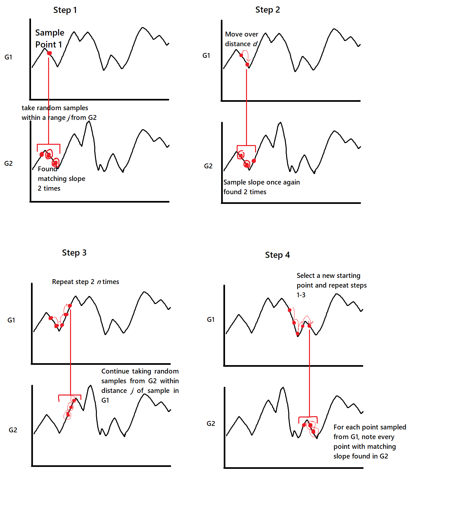

# Hydar-Raye
Original AI chatbot for Hydar-XYZ
The objective in this bot's development was to make something that speaks in a manner similar to existing users of the site.

## How it works
Raye basically boils down to finding something in the input files that most closely matches with what was asked to her and responding with the response from her files.
In other words, if you ask Raye something, it will see if someone else has asked something similar, and give the response that was given to that previous question. Thus, Raye will emulate prior users' conversations.
What makes it "advanced" is not the overall algorithm but the process of which the user's input is compared to lines from the files, as well as the selection process for determining the appropriate response. 
Additionally, some functions were done in C in order to speed up processing.

## First algorithm - compare strings
Each character in a string is mapped to a numerical value (probably ascii code). A graph is then made of the resulting points, with each point's x value corresponding to it's index in the string and the y value corresponding to it's key.
The graphs (G1 and G2) of two strings being analyzed are compared as follows:

In paragraph form, first a point on G1 is selected randomly. The slope of that point is noted. Then, random points on G2 will be sampled within a given range on the x-axis of that point from G1. These points will be selected using a gaussian distribution with the x value of the original point from G1 as it's center. If one of these random points on G2 with the same slope is found, a hit is logged. If the slope is different (or too different within a threshold), a miss is logged.

The next point on G1 selected will be a fixed distance from the previous, somewhat remniscent of various hill climbing methods. The same process of randomly sampling for hits will be conducted.

After a given "length", this "chain" will end, where the length is the number of iterations and the chain is the selection of points taken from G1. A new starting point will be selected randomly from G1. The algorithm will repeat and hits and misses will continue to be logged.

After a set number of chains have been completed, the algorithm will terminate and the total hits versus misses will indicate how similar the strings were.

The point of this complicated sampling and using slopes instead of y values is that strings can be similar in more ways than one. With this algorithm, sentences that the same but offset by a single word can still be found to be similar, and strings which have different variations of certain words will still be found similar. However, strings with the same words in completely the wrong order all throughout the sentence will not be found to be similar. It proved to be a very effective algorithm at determining whether two sentences were similar within my expectations.
